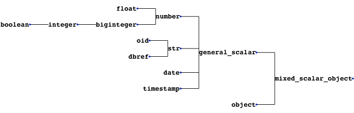

# pymongo-schema
A schema analyser for MongoDB, written in Python. 

This tool allows you to **extract your application's schema, directly from your MongoDB data**. It comes with **powerful schema manipulation and export functionalities**.

It will be particularly useful when you inherit a data dump, and want to quickly learn how the data is structured. 

pymongo-schema allows to map your MongoDB data model to a relational (SQL) data model. This greatly helps to configure [mongo-connector-postgresql](https://github.com/Hopwork/mongo-connector-postgresql), a tool to synchronize data from MongoDB to a target PostgreSQL database.

It also helps you to **compare different versions of your data model**.

This tools is inspired by [variety](https://github.com/variety/variety), with the following enhancement

- extract the **hierarchical structure** of the schema 
- versatile output options : json, yaml, tsv, markdown or htlm
- **finer grained types**. ex: INTEGER, DOUBLE rather than NUMBER 
- **filtering** of the output schema, using a `namespace` as defined by [mongo-connector](https://github.com/mongodb-labs/mongo-connector/wiki/Configuration-Options#configure-namespaces)
- **mapping to a relational schema**
- **comparison** of successive schema

[](https://travis-ci.org/pajachiet/pymongo-schema)
[](https://coveralls.io/github/pajachiet/pymongo-schema?branch=master)


# Install

Before distribution of a stable distribution on PyPi, you can install pymongo-schema from github : 
```shell
pip install --upgrade https://github.com/pajachiet/pymongo-schema/archive/master.zip
```
# Usage

## Command line

```shell
python -m pymongo_schema -h
usage: [-h] [--quiet] {extract,transform,tosql,compare} ...

commands:
  {extract,transform,tosql,compare}
    extract             Extract schema from a MongoDB instance
    transform           Transform a json schema to another format, potentially
                        filtering or changing columns outputs
    tosql               Create a mapping from mongo schema to relational
                        schema (json input and output)
    compare             Compare two schemas

optional arguments:
  -h, --help            show this help message and exit
  --quiet               Remove logging on standard output

Usage:
    python -m pymongo_schema extract -h
    usage:  [-h] [-f [FORMATS [FORMATS ...]]] [-o OUTPUT] [--port PORT] [--host HOST]
                 [-d [DATABASES [DATABASES ...]]] [-c [COLLECTIONS [COLLECTIONS ...]]]
                 [--columns COLUMNS [COLUMNS ...]] [--size SIZE] [--without-counts]
                 
    python -m pymongo_schema transform -h
    usage: [-h] [-f [FORMATS [FORMATS ...]]] [-o OUTPUT] [--category CATEGORY] [-n FILTER]
                [--columns COLUMNS [COLUMNS ...]] [--without-counts] [input]
                
    python -m pymongo_schema tosql -h
    usage: [-h] [-f [FORMATS [FORMATS ...]]] [--columns COLUMNS [COLUMNS ...]]
                [--without-counts] [-o OUTPUT] [input]

    python -m pymongo_schema compare -h
    usage: [-h] [-f [FORMATS [FORMATS ...]]] [-o OUTPUT] [input]
                [--columns COLUMNS [COLUMNS ...]] [--without-counts]
                [--detailed_diff] prev_schema [new_schema]

```

To display full usage, with options description, run:
```shell 
pymongo-schema <command> -h
```

## Python package

pymongo_schema modules can also be imported to be used directly inside python code :

```python
from pymongo_schema.compare import compare_schemas_bases
from pymongo_schema.export import transform_data_to_file
from pymongo_schema.extract import extract_pymongo_client_schema
from pymongo_schema.filter import filter_mongo_schema_namespaces
from pymongo_schema.tosql import mongo_schema_to_mapping
```

Fore more details, refer to modules and functions docstrings.

# Examples

First, lets populate a collection in test database from mongo shell


    db.users.insert({name: "Tom", bio: "A nice guy.", pets: ["monkey", "fish"], someWeirdLegacyKey: "I like Ike!"})
    db.users.insert({name: "Dick", bio: "I swordfight.", birthday: new Date("1974/03/14")})
    db.users.insert({name: "Harry", pets: "egret", birthday: new Date("1984/03/14"), location:{country:"France", city: "Lyon"}})
    db.users.insert({name: "Geneviève", bio: "Ça va?", location:{country:"France", city: "Nantes"}})
    db.users.insert({name: "MadJacques", location:{country:"France", city: "Paris"}})

## Bash api examples
### Easy examples

Extract the schema from this database, with a json format on standard output

    $ python -m pymongo_schema extract --database test
    === Start MongoDB schema analysis
    Extract schema of database test
    ...collection users
       scanned 5 documents out of 5 (100.00 %)
    --- MongoDB schema analysis took 0.00 s
    === Write output

    {"test": {
        "users": {
            "object": {"_id": {"prop_in_object": 1.0, "count": 5, "type": "oid", "types_count": {"oid": 5}},
                       "pets": {"array_types_count": {"string": 2}, "prop_in_object": 0.4, "count": 2, "array_type": "string", "type": "ARRAY", "types_count": {"string": 1, "ARRAY": 1}},
                       "birthday": {"prop_in_object": 0.4, "count": 2, "type": "date", "types_count": {"date": 2}},
                       "name": {"prop_in_object": 1.0, "count": 5, "type": "string", "types_count": {"string": 5}},
                       "bio": {"prop_in_object": 0.6, "count": 3, "type": "string", "types_count": {"string": 3}},
                       "someWeirdLegacyKey": {"prop_in_object": 0.2, "count": 1, "type": "string", "types_count": {"string": 1}},
                       "location": {"object": {"country": {"prop_in_object": 1.0, "count": 3, "type": "string", "types_count": {"string": 3}},
                                               "city": {"prop_in_object": 1.0, "count": 3, "type": "string", "types_count": {"string": 3}}},
                                    "types_count": {"OBJECT": 3}, "prop_in_object": 0.6, "type": "OBJECT", "count": 3}},
            "count": 5}}}

Extract the same schema in md format.

    $ python -m pymongo_schema extract --database test --format md
    === Start MongoDB schema analysis
    Extract schema of database test
    ...collection users
       scanned 5 documents out of 5 (100.00 %)
    --- MongoDB schema analysis took 0.00 s
    === Write output

    ### Database: test
    #### Collection: users 
    |Field_compact_name     |Field_name             |Count     |Percentage     |Types_count                           |
    |-----------------------|-----------------------|----------|---------------|--------------------------------------|
    |_id                    |_id                    |5         |100.0          |oid : 5                               |
    |name                   |name                   |5         |100.0          |string : 5                            |
    |bio                    |bio                    |3         |60.0           |string : 3                            |
    |location               |location               |3         |60.0           |OBJECT : 3                            |
    | . city                |city                   |3         |100.0          |string : 3                            |
    | . country             |country                |3         |100.0          |string : 3                            |
    |birthday               |birthday               |2         |40.0           |date : 2                              |
    |pets                   |pets                   |2         |40.0           |ARRAY(string : 2) : 1, string : 1     |
    |someWeirdLegacyKey     |someWeirdLegacyKey     |1         |20.0           |string : 1                            |

Map this schema to a relational mapping

    $ python -m pymongo_schema extract --database test | python -m pymongo_schema tosql
    === Start MongoDB schema analysis
    Extract schema of database test
    ...collection users
       scanned 5 documents out of 5 (100.00 %)
    --- MongoDB schema analysis took 0.00 s
    === Write output
    === Generate mapping from mongo to sql
    === Write output

    {"test":
     {"users":
          {"_id": {"type": "TEXT", "dest": "_id"},
           "pets": {"valueField": "pets", "fk": "id_users", "type": "_ARRAY_OF_SCALARS", "dest": "users__pets"},
           "location.city": {"type": "TEXT", "dest": "location__city"},
           "name": {"type": "TEXT", "dest": "name"},
           "someWeirdLegacyKey": {"type": "TEXT", "dest": "someWeirdLegacyKey"},
           "pk": "_id",
           "bio": {"type": "TEXT", "dest": "bio"},
           "birthday": {"type": "TIMESTAMP", "dest": "birthday"},
           "location.country": {"type": "TEXT", "dest": "location__country"}},
      "users__pets": {"id_users": {"type": "TEXT"},
                      "pets": {"type": "TEXT", "dest": "pets"},
                      "pk": "_id_postgres"}}}

### Other examples

**extract:** Extract the schema for collections `test_collection_1` and `test_collection_2` from `test_db` and write it into `mongo_schema.html` and `mongo_schema.json` files
```shell
    python -m pymongo_schema extract --databases test_db --collections test_collection_1 test_collection_2 --output mongo_schema --format html json
```
**extract:** Extract the schema for collection `test_collection_1` with only 1000 random rows scanned and write it into `mongo_schema.html` files
```shell
    python -m pymongo_schema extract --collections test_collection_1 --size 1000 --output mongo_schema --format html
```
**transform:** Filter extracted schema (`mongo_schema.json`) using `namespace.json` file and write output into `mongo_schema_filtered.html`, `mongo_schema_filtered.csv` and `mongo_schema_filtered.json` files
```shell
    python -m pymongo_schema transform mongo_schema.json --filter namespace.json --output mongo_schema_filtered --format html csv json
```
**tosql:** Create mapping file based on `mongo_schema_filtered.json`
```shell
    python -m pymongo_schema tosql mongo_schema_filtered.json --output mapping.json
```

## Python api examples

Extract the schemas of all collections and all databases in a MongoDB instance:

```python
import pymongo
from pymongo_schema.extract import extract_pymongo_client_schema

with pymongo.MongoClient() as client:
    schema = extract_pymongo_client_schema(client)
```
Arguments can be specified to extract only some databases and some collections. See code documentation for more details.

Filter extract schema with a `namespace`:
```python
import json
from pymongo_schema.filter import filter_mongo_schema_namespaces

# assuming a namespace is defined in a file named namespace.json
with open("namespace.json") as f:
    namespace = json.load(f)

schema_filtered = filter_mongo_schema_namespaces(schema, namespace)
```

Save filtered_schema (could be used for schema) to file in json and md formats in a `docs` directory:
```python
from pymongo_schema.export import transform_data_to_file

transform_data_to_file(schema_filtered, ['json', 'md'], output='docs/schema_filtered')
```

Compare filtered_schema (could be used for schema) to another (previous for example) schema:
```python
from pymongo_schema.compare import compare_schemas_bases

# assuming a namespace is defined in a file named namespace.json
with open("old_schema_filtered.json") as f:
    old_schema_filtered = json.load(f)

differences = compare_schemas_bases(old_schema_filtered, schema_filtered)
```

Save differences to file in json and md formats in a `docs` directory:
```python
transform_data_to_file(differences, ['json', 'md'], output='docs/diff', category='diff')
```

Transform filtered_schema to a relational mapping:
```python
from pymongo_schema.tosql import mongo_schema_to_mapping

mapping = mongo_schema_to_mapping(schema_filtered)
```

Save mapping to file in json and md formats in a `docs` directory:
```python
transform_data_to_file(mapping, ['json', 'md'], output='docs/mapping', category='mapping')
```

# Schema

We define 'schema' as a dictionary describing the structure of MongoDB component, being either a MongoDB instances, a database, a collection, an objects or a field. 
 
Schema are hierarchically nested, with the following structure :  


```python 
# mongo_schema : A MongoDB instance contains databases
{
    "database_name_1": {}, #database_schema,
    "database_name_2": # A database contains collections
    { 
        "collection_name_1": {}, # collection_schema,
        "collection_name_2": # A collection maintains a 'count' and contains 1 object
        { 
            "count" : int, 
            "object":  # object_schema : An object contains fields.            
             {
                "field_name_1" : {}, # field_schema, 
                "field_name_2": # A field maintains 'types_count_information
                                # An optional 'array_types_count' field maintains 'types_count' information for values encountered in arrays 
                                # An 'OBJECT' or 'ARRAY(OBJECT)' field recursively contains 1 'object'
                {
                    'count': int,
                    'prop_in_object': float,
                    'type': 'type_str', 
                    'types_count': {  # count for each encountered type  
                        'type_str' : 13,
                        'Null' : 3
                    }, 
                    'array_type': 'type_str',
                    'array_types_count': {  # (optional) count for each type encountered  in arrays
                        'type_str' : 7,
                        'Null' : 3
                    }, 
                    'object': {}, # (optional) object_schema 
                } 
            } 
        }
    }           
}
```
# Contributing - Limitations - TODO 
The code base should be easy to read and improve upon. Contributions are welcomed.

## Mixed types handling
pymongo-schema handles mixed types by looking for the lowest common parent type in the following tree.



If a field contains both arrays and scalars, it is considered as an array. The 'array_type' is defined as the common parent type of scalars and array_types encountered in this field. 

TODO

- Improve mapping from Python type to name (TYPE_TO_STR dict)
    - see documentation: [bson-types](https://docs.mongodb.com/manual/reference/bson-types/), [spec](http://bsonspec.org/spec.html)

- Check a mongo scheme for compatibility to an sql mapping
- Handle incompatibilities

## Support Python 3 version

- fix encoding issues when exporting manually added non-ascii characters

## Diff between schemas

A way to compare the schema dictionaries and highlights the differences.


## Test if a mongo schema can be mapped tosql

- test for the presence of mongo types in the mapping 
- look for mixes of list and scalar, that are currently not supported by mongo-connector-postgresql
- look for the presence of an '_id'

=> It may be donne directly in mongo-connector-postgresql doc_manager


## Adding fields in json/yaml outputs

- for example to add comments


## Other option to sort text outputs

- It is currently based on counts and then alphabetically.


## Tackle bigger databases
This code has been only used on a relatively small sized Mongo database, on which it was faster than Variety. 

To tackle bigger databases, it certainly would be usefull to implement the following variety's features :

- Analyze subsets of documents, most recent documents, or documents to a maximum depth.

## Tests
The codebase is still under development. It should not be trusted blindly.

## Distribution

Will be distributed in PyPi


